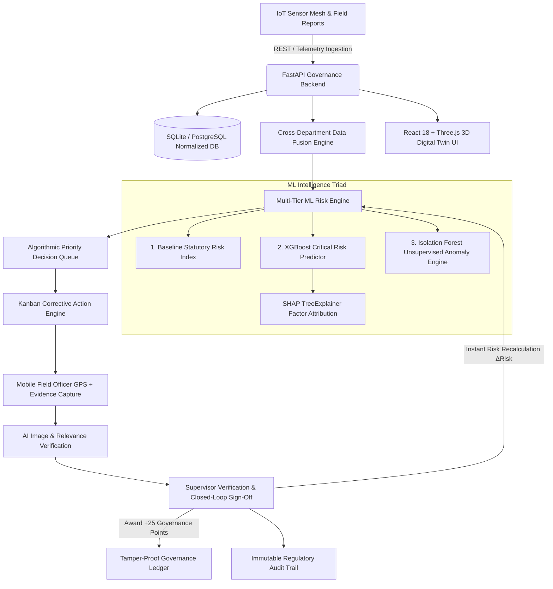

# ⛏️ COALGUARD AI
### AI-Based Smart Governance and Compliance Monitoring System for Coal Mines
**Smart India Hackathon (SIH 2026) | Problem Statement: SIH26024**

---

## 🌟 Executive Summary

**CoalGuard AI** is a state-of-the-art predictive governance and compliance monitoring platform engineered for India's coal mining sector (specifically modeled for South Eastern Coalfields Limited — SECL). It addresses statutory DGMS regulations, environmental pollution controls (CPCB/SPCB), and contractor worker safety through a closed-loop data fusion and machine learning architecture.

Unlike passive reporting systems, CoalGuard AI closes the loop:
$$\text{Daily Reporting} \longrightarrow \text{Cross-Department Fusion} \longrightarrow \text{ML Risk Triad} \longrightarrow \text{Priority Queue} \longrightarrow \text{Field Evidence (GPS+Photo)} \longrightarrow \text{Supervisor Sign-Off} \longrightarrow \text{Dynamic Risk Recalculation} \longrightarrow \text{Verified Governance Points}$$

---

## 🏛️ System Architecture



---

## 🚀 Key Functional Modules & Pages

| Module | URL Route | Description |
| :--- | :--- | :--- |
| **Executive Portfolio Dashboard** | `/` | Portfolio overview, KPI metrics, risk comparison charts, and live leaderboard. |
| **GIS Command Center** | `/command-center` | Interactive GIS mapping, operational intelligence, and alert feeds. |
| **3D Mine Digital Twin** | `/mines`, `/mines/:id` | Three.js interactive terrain twin, camera presets, and live IoT sensor telemetry. |
| **Priority Decision Queue** | `/priority-queue` | Algorithmic triage queue prioritizing critical recommendations & SLA breaches. |
| **Risk Engine & SHAP** | `/risk` | Multi-department risk breakdown, SHAP explainability waterfall, and triad metrics. |
| **What-If Intervention Simulator** | `/what-if` | Non-destructive operational intervention simulator forecasting risk deltas. |
| **Closed-Loop Action Board** | `/actions` | 6-stage Kanban board (OPEN $\to$ ASSIGNED $\to$ IN_PROGRESS $\to$ IN_REVIEW $\to$ VERIFIED $\to$ CLOSED). |
| **Mobile Field Officer Portal** | `/field-officer` | Mobile-ready GPS location capture and photo evidence upload. |
| **Supervisor Review & Sign-Off** | `/supervisor-review` | AI visual evidence inspection, closed-loop verification, and risk delta calculation. |
| **Daily Compliance Reporting** | `/daily-reporting` | Role-tailored daily statutory checklists awarding +10 Governance Points. |
| **Safety & DGMS Compliance** | `/safety` | DGMS Coal Mines Regulations (CMR 2017) compliance and hazard logging. |
| **Environmental Monitoring** | `/environment` | Real-time ambient air PM2.5/PM10, water discharge pH, and noise monitoring. |
| **Contractor Safety Oversight** | `/contractors` | Vendor safety rating, VTC worker training ratios, and PPE compliance rates. |
| **Statutory Inspections** | `/inspections` | DGMS statutory audits, violation tracking, and rectification logs. |
| **Compliance Documents Vault** | `/compliance` | EC, CTO, CTE, and Mining Lease document repository with OCR preview. |
| **Citizen Grievance Portal** | `/public-report`, `/incidents` | Public hazard reporting interface with triage conversion into corrective actions. |
| **Governance Score Ledger** | `/governance-score` | 1000-point verified governance score ledger and officer ranking leaderboard. |
| **Operational Timeline** | `/timeline` | Multi-department chronological live operational event stream. |
| **Immutable Audit Trail** | `/audit-trail` | Regulatory audit log with one-click CSV export for DGMS inspectors. |
| **IoT Telemetry & Spike Control** | `/iot-control` | High-frequency telemetry charts with instant demo anomaly injection. |
| **User Directory & RBAC** | `/users` | Persona roster across 10 distinct governance tiers. |
| **Platform Settings** | `/settings` | Risk weight calibration, SLA escalation intervals, and threshold tuning. |

---

## 🔑 Demo Personas & Credentials

| Role | Email | Password |
| :--- | :--- | :--- |
| **Head Admin** | `admin@coalguard.ai` | `Admin@123` |
| **Mine Manager** | `manager@coalguard.ai` | `Manager@123` |
| **Supervisor** | `supervisor@coalguard.ai` | `Supervisor@123` |
| **Safety Officer** | `safety@coalguard.ai` | `Safety@123` |
| **Environmental Officer** | `environment@coalguard.ai` | `Environment@123` |
| **Contractor Officer** | `contractor@coalguard.ai` | `Contractor@123` |
| **Field Officer** | `field@coalguard.ai` | `Field@123` |
| **Auditor / Regulator** | `auditor@coalguard.ai` | `Auditor@123` |
| **Regional Manager** | `regional@coalguard.ai` | `Regional@123` |
| **Area Manager** | `area@coalguard.ai` | `Area@123` |

---

## 🛠️ Quickstart Installation & Running

### Option A: One-Click Windows Startup
Double-click `start-all.bat` in the root directory.

### Option B: Manual Setup

#### 1. Backend Setup
```bash
cd backend
# Create virtual environment
python -m venv venv
# Activate virtual environment
venv\Scripts\activate  # Windows: venv\Scripts\activate | Linux/macOS: source venv/bin/activate
# Install requirements
pip install -r requirements.txt
# Train ML models
python ml/train.py
# Seed demo dataset
python scripts/seed_demo.py
# Run FastAPI server
uvicorn app.main:app --host 0.0.0.0 --port 8000 --reload
```

#### 2. Frontend Setup
```bash
cd frontend
npm install
npm run dev
```

Visit **`http://localhost:5173`** in your browser.

---

## 🧪 Automated Test Suite

To run the complete automated test suite (90 tests across all modules):
```bash
cd backend
python -m pytest tests/
```
**Current Status**: `90 passed, 0 failed` (100% pass rate).

---

## 🐳 Docker Deployment

```bash
docker-compose up --build
```
- Frontend: `http://localhost:5173`
- Backend Swagger API Docs: `http://localhost:8000/docs`
